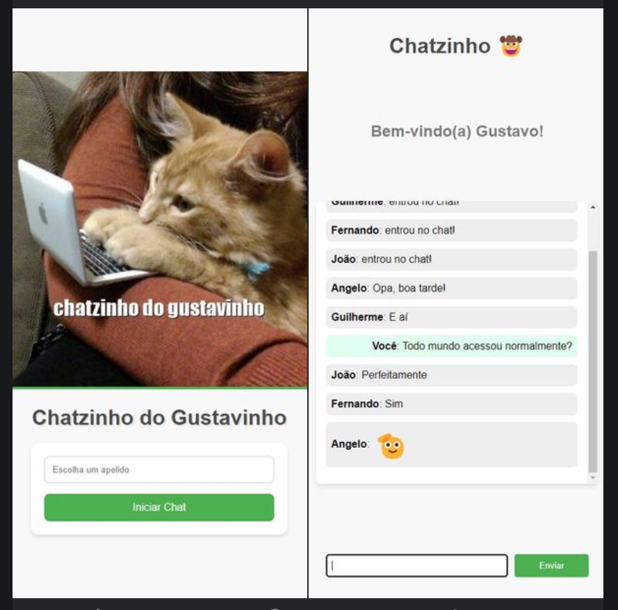

# WebChat Online

A simple webchat project built with FastAPI.


## Features

- Connection via WebSocket.
- Real-time message sending.
- Notification when a user enters or leaves the chat.
- Customizable nickname for users.

## Installation and Usage

1. Install the necessary dependencies:

    ```bash
    pip install fastapi[all] uvicorn websockets
    ```

2. Clone this repository or copy the code above.

3. Run the server:

    ```bash
    uvicorn main:app --reload --host 192.168.1.6 --port 8000
    ```

4. Access the webchat in the browser at http://192.168.1.6:8000/

## Structure

The project is structured as follows:

- `ConnectionManager`: Class responsible for managing active WebSocket connections.
- `app`: FastAPI instance.
- Endpoints:
  - `/`: Webchat's home page.
  - `/chat`: Chat page.
  - `/ws/{client_id}`: WebSocket endpoint for real-time communication.

## Security Considerations

This project was created for learning and testing purposes and may contain vulnerabilities. The CORS middleware is configured to allow any origin, method, and header, which may not be safe for a production environment.

## Contribution

Feel free to contribute with improvements and fixes for possible vulnerabilities!